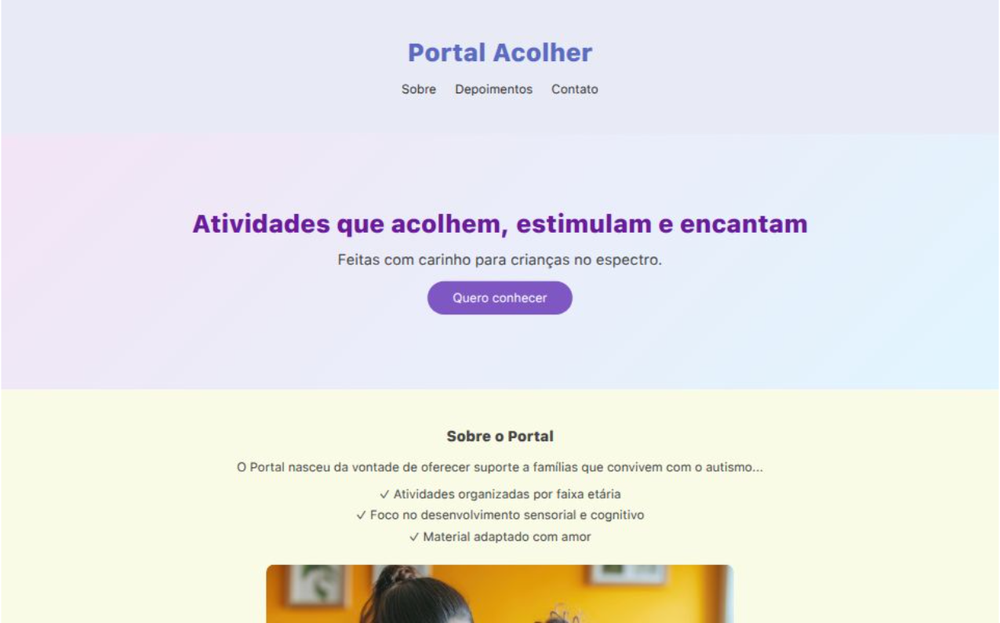

# 🌈 Portal Acolher – Landing Page

Landing Page responsiva e otimizada com foco em conversão para o **Portal de Atividades Infantis com Foco no Autismo**. Desenvolvida com HTML, CSS e JavaScript, este projeto visa acolher famílias oferecendo conteúdos adaptados, educativos e sensoriais para crianças no espectro autista.

## 💡 Funcionalidades

- ✅ Design acolhedor e responsivo (mobile-first)
- ✅ Headline clara e emocional
- ✅ Seção “Sobre” com carrossel de imagens
- ✅ Depoimentos reais de mães
- ✅ Formulário de contato com modal de confirmação
- ✅ Botões com efeitos visuais (hover e animações)
- ✅ Otimização para SEO com metatags personalizadas
- ✅ Favicon e estrutura pronta para integração futura com e-mail marketing

## 📸 Preview

 

[👉 Clique aqui para visitar a página](https://landingpage-portal-acolher.vercel.app)

## 🛠️ Tecnologias Utilizadas

- HTML5
- CSS3
- JavaScript (Vanilla)
- Fontes: Google Fonts (Montserrat, Quicksand)

## 🚀 Como Visualizar

1. Clone o repositório:
```bash
git clone https://github.com/seu-usuario/portal-acolher.git
```

2. Abra o arquivo index.html no seu navegador.

## 📩 Contato
Se quiser adaptar este projeto para seu negócio, entre em contato comigo por e-mail ou pelas redes sociais:

- ✉️ ivannatech@gmail.com
- 💼 [LinkedIn](https://www.linkedin.com/in/ivanna-almeida/)
- 🖥️ [GitHub](https://github.com/ivannatech)

---

> Este projeto é parte de um portfólio de desenvolvedora web freelancer e está disponível para uso não-comercial ou como base para novos projetos personalizados.

